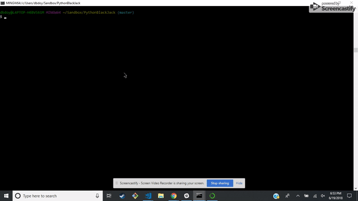

# PythonBlackJack

A simple game of _Black Jack_ played in your terminal using Python. 



## Installation

1. Make sure that you have [Python](https://www.python.org/downloads/) installed on your computer and the path variable correctly set.
1. Alternately install [Anaconda](https://conda.io/docs/user-guide/install/index.html) and use Python through their navigator.
1. Fork this repository over to your GitHub account and clone the repo to your local machine: ```git clone https://github.com/<YOUR_GITHUB_USERNAME_HERE>/PythonBlackJack.git```

## Set Up

1. Once you've complete the above steps, navigate to the PythonBlackJack folder with your terminal.
1. Run the command ```python app.py``` from the terminal.
1. Enjoy a simple game of Black Jack!

## Authors

* [Daniel Doyle](https://github.com/dbdoyle182)

